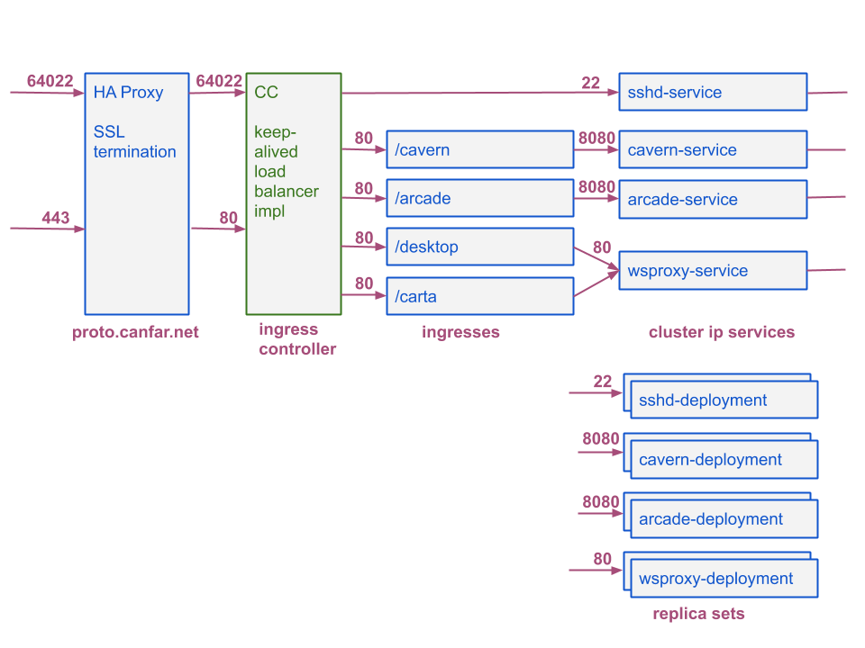
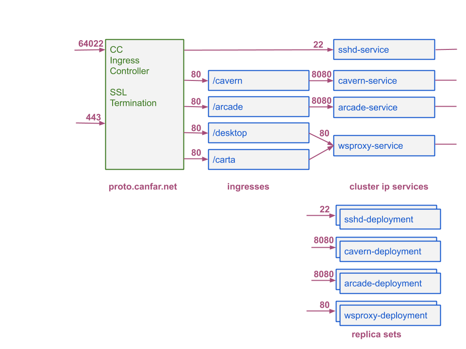

# arcade-k8s-config
Kubernetes deployment of arcade and cavern

## Overview
This module contains the prototype deployment configuration of arcade and cavern in kubernetes.

## kubernetes installation

Notes under an installation step indicate that configuration values must be changed to match the specifics of the kubernetes install.

### namespaces

The following namespaces are in use for cavern and arcade installation
   * skaha-system - for system services (deployments)
   * skaha-workload - for user sessions and applications (jobs)
   * cadc-harbor - for harbor
   * cadc-sssd - for the sssd daemonsets

### cavern installation steps

1. create servops secret (/cavern/certs/create-servops-secret.sh)
2. create sssd configmap (/sssd/create-config.sh)
3. create sssd daemonset (/sssd/apply-sss-daemonset.sh)
4. create cavern tomcat config maps (/cavern/cavern-tomcat/create-config.sh)
  - catalina.properties refers to hostname
  - Cavern.properties refers to hostname
  - cavern volume is installation specific
  - cephfs path set to /cavern-dev
5. create cavern tomcat deployment (/cavern/cavern-tomcat/deploy-cavern-tomcat.sh)
6. create cavern tomcat service (/cavern/cavern-tomcat/expose-cavern-tomcat.sh)
7. create cavern tomcat ingress (/cavern/ingress)
  - ingress referens to hostname
8. create sshd cert secrets (/cavern/sssd-certs)
9. create sshd config map (/cavern/sshd-and-sssd)
10. create sshd deployment (/cavern/sshd-and-sssd)
11. create sshd service (/cavern/sshd-and-sssd)

### arcade installation steps

1. create servops secret (/arcade/certs/create-servops.secret.sh)
2. create arcade configmaps
  - catalina.properties refers to hostname
  - cavern volume is installation specific
3. create arcade-tomcat deployment (/arcade/arcade-tomcat)
4. create arcade service (/arcade/arcade-tomcat)
5. create arcade ingress (/arcade/ingress)
6. create arcade-wsproxy config map (/arcade/arcade-wsproxy)
  - README.md explains how to create configuration file
7. create arcade-wsproxy deployment (/arcade/arcade-wsproxy)
  - python redirect scripts in images reference namespaces
8. create arcade-wsproxy service (/arcade/arcade-wsproxy)
9. create desktop ingress (/arcade/ingress)
10. create carta ingress (/arcade/ingress)
11. create notebook ingress (/arcade/ingress)

## Network

### Current network

The HA Proxy VM is there to support client proxy certificates.  The 'future' diagram below is what we'd like the network architecture to look like.  nginx in the ingress controller uses a newer version of openssl which requires apps (nginx in this case) to expose the configuration required to enable proxy certificates.  nginx does not allow that at this time.

This setup is not ideal because of the single point of failure in HA Proxy.

### Future network

In this setup SSL termination is done right in the ingress.  Because the ingress is load balanced it does not have a single point of failure.
